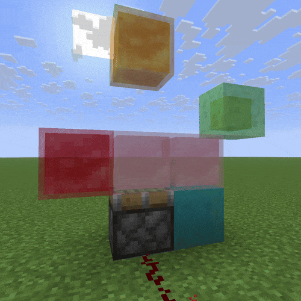
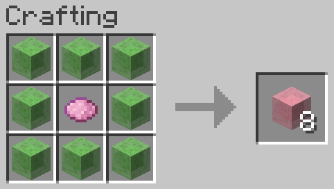

# Colored Slime Blocks

## Setup

Drop the JAR file into your Mods Folder. Requires the Fabric API.

## Usage

In a Crafting Table, place any dye surrounded by eight Slime Blocks. The resulting slime blocks work just like any
normal slime block, but they do not stick to normal slime blocks (or other slime blocks of other colors).

**... Now also supports Colored Honey Blocks!**

Enjoy!

